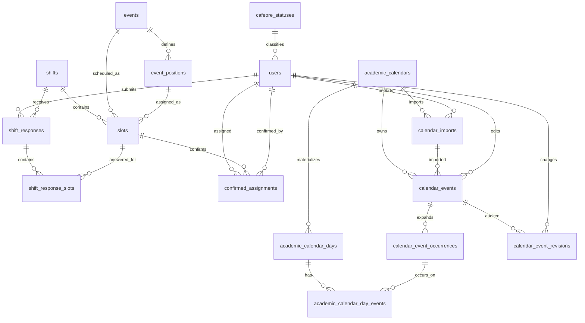

# Aula DB設計書

## 1. 方針

本設計はCloudflare D1（SQLite互換）を対象とし、Google Calendar連携は対象外とする。大学学年暦のiCalendar（ICS）取込は、授業日・休講日・振替日を判定する内部データとして扱う。

- 主キーはWorkerで生成するUUID v4の`TEXT`とする。
- 日時はISO 8601 UTC、日付は`YYYY-MM-DD`、時刻は`HH:mm:ss`で保存する。
- booleanは`INTEGER`の`0 / 1`とし、CHECK制約を付ける。
- enumは`TEXT`とし、CHECK制約を付ける。
- 外部キーを有効化し、削除規則を明示する。
- APIのJSONはcamelCase、D1カラムはsnake_caseとする。
- 業務上の日付・曜日計算は`Asia/Tokyo`で行う。

## 2. 全体ER図



## 3. ユーザー・会員区分

### 3.1 `cafeore_statuses`

| カラム | D1型 | NULL | 制約 | 内容 |
| --- | --- | --- | --- | --- |
| `id` | TEXT | No | PK | 会員区分ID |
| `name` | TEXT | No | UNIQUE | 区分名 |
| `is_first_year` | INTEGER | No | CHECK | 1年目か |
| `is_examiner` | INTEGER | No | CHECK | 試験官か |
| `is_apprentice` | INTEGER | No | CHECK | 練習生か |
| `created_at` | TEXT | No |  | 作成日時 |
| `updated_at` | TEXT | No |  | 更新日時 |
| `version` | INTEGER | No | DEFAULT 1 | 楽観ロック |

### 3.2 `users`

| カラム | D1型 | NULL | 制約 | 内容 |
| --- | --- | --- | --- | --- |
| `id` | TEXT | No | PK | ユーザーID |
| `access_subject` | TEXT | No | UNIQUE | Cloudflare Access JWTの`sub` |
| `name` | TEXT | No |  | 氏名 |
| `display_name` | TEXT | No |  | 表示名 |
| `email` | TEXT | No | UNIQUE | Accessで検証済みのメール |
| `entrance_year` | INTEGER | No | CHECK | 入学年度 |
| `photo_url` | TEXT | Yes |  | プロフィール画像URL |
| `cafeore_status_id` | TEXT | No | FK | `cafeore_statuses.id` |
| `is_admin` | INTEGER | No | CHECK, DEFAULT 0 | 管理者か |
| `is_graduated` | INTEGER | No | CHECK, DEFAULT 0 | 卒業済みか |
| `created_at` | TEXT | No |  | 作成日時 |
| `updated_at` | TEXT | No |  | 更新日時 |
| `last_login_at` | TEXT | Yes |  | 最終ログイン日時 |
| `version` | INTEGER | No | DEFAULT 1 | 楽観ロック |

`cafeore_status_id`は`ON DELETE RESTRICT`とする。通常の退会は物理削除ではなく`is_graduated = 1`で扱う。

## 4. 業務イベント・シフト

### 4.1 `events`

学年暦イベントとは別の、珈琲・俺で実施する業務イベントを表す。

| カラム | D1型 | NULL | 制約 | 内容 |
| --- | --- | --- | --- | --- |
| `id` | TEXT | No | PK | イベントID |
| `name` | TEXT | No |  | イベント名 |
| `start_date` | TEXT | No |  | 開始日 |
| `end_date` | TEXT | No | CHECK | 終了日。開始日以降 |
| `created_at` | TEXT | No |  | 作成日時 |
| `updated_at` | TEXT | No |  | 更新日時 |
| `version` | INTEGER | No | DEFAULT 1 | 楽観ロック |

### 4.2 `event_positions`

| カラム | D1型 | NULL | 制約 | 内容 |
| --- | --- | --- | --- | --- |
| `id` | TEXT | No | PK | 担当区分ID |
| `event_id` | TEXT | No | FK, INDEX | `events.id` |
| `name` | TEXT | No |  | 担当名 |
| `description` | TEXT | Yes |  | 説明 |
| `display_order` | INTEGER | No | DEFAULT 0 | 表示順 |
| `created_at` | TEXT | No |  | 作成日時 |
| `updated_at` | TEXT | No |  | 更新日時 |
| `version` | INTEGER | No | DEFAULT 1 | 楽観ロック |

`UNIQUE (event_id, name)`とし、`event_id`は`ON DELETE CASCADE`とする。ただしSlotから参照中のEventPositionを含むEventはAPIで削除を拒否する。

### 4.3 `shifts`

| カラム | D1型 | NULL | 制約 | 内容 |
| --- | --- | --- | --- | --- |
| `id` | TEXT | No | PK | シフトID |
| `year` | INTEGER | No | CHECK | 年度 |
| `semester` | TEXT | No | CHECK | `spring`, `summer`, `autumn` |
| `module` | TEXT | No |  | `A`, `B`, `C`または夏季週番号 |
| `start_date` | TEXT | No |  | 対象開始日 |
| `end_date` | TEXT | No | CHECK | 対象終了日 |
| `required_sessions_per_week` | INTEGER | No | CHECK | `1`または`2` |
| `is_vacation` | INTEGER | No | CHECK, DEFAULT 0 | 長期休業シフトか |
| `is_open` | INTEGER | No | CHECK, DEFAULT 0 | 回答受付中か |
| `created_at` | TEXT | No |  | 作成日時 |
| `updated_at` | TEXT | No |  | 更新日時 |
| `version` | INTEGER | No | DEFAULT 1 | 楽観ロック |

`UNIQUE (year, semester, module)`で同一募集の重複を防止する。

### 4.4 `slots`

| カラム | D1型 | NULL | 制約 | 内容 |
| --- | --- | --- | --- | --- |
| `id` | TEXT | No | PK | 枠ID |
| `shift_id` | TEXT | No | FK, INDEX | `shifts.id` |
| `event_id` | TEXT | No | FK, INDEX | `events.id` |
| `position_id` | TEXT | No | FK, INDEX | `event_positions.id` |
| `day_of_week` | INTEGER | No | CHECK 1〜7 | 月曜1〜日曜7 |
| `period` | INTEGER | No | CHECK 1〜8 | 時限 |
| `display_order` | INTEGER | No | DEFAULT 0 | 表示順 |
| `start_time` | TEXT | No |  | 開始時刻 |
| `end_time` | TEXT | No | CHECK | 終了時刻 |
| `created_at` | TEXT | No |  | 作成日時 |
| `updated_at` | TEXT | No |  | 更新日時 |
| `version` | INTEGER | No | DEFAULT 1 | 楽観ロック |

- `UNIQUE (shift_id, event_id, position_id, day_of_week, period)`とする。
- `position_id`が指すEventPositionの`event_id`と、Slotの`event_id`は一致させる。この整合性はWorkerまたはDBトリガーで検証する。
- 親FKは`ON DELETE RESTRICT`とする。

## 5. シフト回答・確定割当

### 5.1 `shift_responses`

1ユーザーが1シフトへ提出する回答のヘッダー。頻度・コメント・提出状態を保存する。

| カラム | D1型 | NULL | 制約 | 内容 |
| --- | --- | --- | --- | --- |
| `id` | TEXT | No | PK | 回答ID |
| `shift_id` | TEXT | No | FK, INDEX | 対象シフト |
| `user_id` | TEXT | No | FK, INDEX | 回答者 |
| `frequency` | TEXT | No | CHECK | `ONCE_WEEKLY`, `TWICE_WEEKLY`, `EXAMINER` |
| `comment` | TEXT | No | DEFAULT '' | コメント |
| `submitted_at` | TEXT | No |  | 初回提出日時 |
| `updated_at` | TEXT | No |  | 最終更新日時 |
| `version` | INTEGER | No | DEFAULT 1 | 楽観ロック |

`UNIQUE (shift_id, user_id)`とする。ShiftまたはUserの削除は`ON DELETE RESTRICT`とする。

### 5.2 `shift_response_slots`

| カラム | D1型 | NULL | 制約 | 内容 |
| --- | --- | --- | --- | --- |
| `response_id` | TEXT | No | PK, FK | `shift_responses.id` |
| `slot_id` | TEXT | No | PK, FK | `slots.id` |
| `is_available` | INTEGER | No | CHECK | 割当可能か |
| `created_at` | TEXT | No |  | 作成日時 |
| `updated_at` | TEXT | No |  | 更新日時 |

複合主キー`(response_id, slot_id)`とする。Response削除時は`ON DELETE CASCADE`、Slot削除は`ON DELETE RESTRICT`とする。SlotとResponseが同じShiftに属することをWorkerまたはDBトリガーで検証する。

### 5.3 `confirmed_assignments`

| カラム | D1型 | NULL | 制約 | 内容 |
| --- | --- | --- | --- | --- |
| `id` | TEXT | No | PK | 確定割当ID |
| `slot_id` | TEXT | No | FK, INDEX | 対象枠 |
| `user_id` | TEXT | No | FK, INDEX | 割当ユーザー |
| `confirmed_by` | TEXT | No | FK | 確定したAdmin |
| `confirmed_at` | TEXT | No |  | 確定日時 |

`UNIQUE (slot_id, user_id)`とする。SlotまたはUserの削除は`ON DELETE RESTRICT`とする。原則として対象Slotに`is_available = 1`と回答したユーザーだけを割当可能とする。

## 6. iCalendar学年暦

大学のICSは一度だけ取り込み、元ファイルを破棄する。以後はD1へ保存したイベントをAdminが追加・編集・削除し、日別授業状態を再計算する。

ICS解析では次を必須とする。

- 全`VEVENT`を保存し、同日・同名イベントも削除しない。
- 継続行はRFC 5545のline unfoldingに従って結合する。
- `RRULE`, `RDATE`, `EXDATE`, `RECURRENCE-ID`を年度範囲内へ展開する。
- `UID`がないイベントは、ICS内の出現順と正規化VEVENTのSHA-256で識別する。
- 終日イベントの`DTEND`は排他的終了日として保存する。
- 同日に複数イベントが存在できるため、日付をイベントの一意キーにしない。
- 「月曜授業」など、実際の曜日と授業として扱う曜日が異なる振替日を保持する。

### 6.1 `academic_calendars`

| カラム | D1型 | NULL | 制約 | 内容 |
| --- | --- | --- | --- | --- |
| `id` | TEXT | No | PK | 学年暦ID |
| `academic_year` | INTEGER | No | UNIQUE | 年度 |
| `name` | TEXT | No |  | 名称 |
| `timezone` | TEXT | No | DEFAULT `Asia/Tokyo` | タイムゾーン |
| `range_start` | TEXT | No |  | 年度開始日 |
| `range_end_exclusive` | TEXT | No | CHECK | 排他的終了日 |
| `status` | TEXT | No | CHECK | `IMPORTING`, `ACTIVE`, `DISABLED` |
| `created_at` | TEXT | No |  | 作成日時 |
| `updated_at` | TEXT | No |  | 更新日時 |
| `version` | INTEGER | No | DEFAULT 1 | 楽観ロック |

### 6.2 `calendar_imports`

ICS本体ではなく取込結果のメタデータだけを保存する。

| カラム | D1型 | NULL | 制約 | 内容 |
| --- | --- | --- | --- | --- |
| `id` | TEXT | No | PK | 取込ID |
| `calendar_id` | TEXT | No | FK, INDEX | 対象学年暦 |
| `original_filename` | TEXT | No |  | 元ファイル名 |
| `content_sha256` | TEXT | No | INDEX | ファイルSHA-256 |
| `status` | TEXT | No | CHECK | `PROCESSING`, `COMPLETED`, `FAILED` |
| `event_count` | INTEGER | No | DEFAULT 0 | VEVENT件数 |
| `occurrence_count` | INTEGER | No | DEFAULT 0 | 展開件数 |
| `error_message` | TEXT | Yes |  | 失敗理由 |
| `imported_by` | TEXT | No | FK | 実行Admin |
| `started_at` | TEXT | No |  | 開始日時 |
| `completed_at` | TEXT | Yes |  | 完了日時 |

- 部分UNIQUE INDEXで`calendar_id`ごとの`COMPLETED`を1件に制限し、一度だけの初期取込を保証する。
- 同一SHA-256の`PROCESSING`は二重実行せず既存処理を返す。`FAILED`は同じファイルで再試行できる。
- ICS本文をD1、R2、ログへ保存しない。

### 6.3 `calendar_events`

ICS由来イベントとAdmin追加イベントを同じ形式で保存する。

| カラム | D1型 | NULL | 制約 | 内容 |
| --- | --- | --- | --- | --- |
| `id` | TEXT | No | PK | 学年暦イベントID |
| `calendar_id` | TEXT | No | FK, INDEX | 所属学年暦 |
| `import_id` | TEXT | Yes | FK, INDEX | ICS由来時の取込ID |
| `source_type` | TEXT | No | CHECK | `ICAL_IMPORT`, `ADMIN` |
| `source_order` | INTEGER | Yes | 複合UNIQUE | ICS内出現順 |
| `source_key` | TEXT | Yes |  | 正規化VEVENTのSHA-256 |
| `ical_uid` | TEXT | Yes | INDEX | ICS UID |
| `recurrence_id` | TEXT | Yes |  | 例外イベントID |
| `summary` | TEXT | No |  | タイトル |
| `description` | TEXT | Yes |  | 説明 |
| `location` | TEXT | Yes |  | 場所 |
| `event_type` | TEXT | No | CHECK, INDEX | イベント分類 |
| `instruction_effect` | TEXT | No | CHECK | `NONE`, `CLOSE`, `SUBSTITUTE`, `OUTSIDE_TERM` |
| `publication_status` | TEXT | No | CHECK | `DRAFT`, `PUBLISHED` |
| `is_all_day` | INTEGER | No | CHECK | 終日か |
| `start_date` | TEXT | 条件付 | INDEX | 終日開始日 |
| `end_date_exclusive` | TEXT | 条件付 | INDEX | 終日排他的終了日 |
| `starts_at` | TEXT | 条件付 |  | 時刻開始日時 |
| `ends_at` | TEXT | 条件付 |  | 時刻終了日時 |
| `timezone` | TEXT | Yes |  | TZID |
| `rrule` | TEXT | Yes |  | RRULE |
| `rdates_json` | TEXT | No | JSON, DEFAULT '[]' | RDATE |
| `exdates_json` | TEXT | No | JSON, DEFAULT '[]' | EXDATE |
| `substitute_weekday` | INTEGER | Yes | CHECK 1〜7 | 振替元曜日 |
| `ical_status` | TEXT | Yes |  | ICS STATUS |
| `transparency` | TEXT | Yes |  | ICS TRANSP |
| `sequence_number` | INTEGER | Yes |  | ICS SEQUENCE |
| `raw_properties_json` | TEXT | Yes | JSON | 元プロパティ |
| `is_manually_modified` | INTEGER | No | CHECK, DEFAULT 0 | ICS由来を手動編集したか |
| `created_by` | TEXT | Yes | FK | Admin作成者 |
| `updated_by` | TEXT | Yes | FK | 最終更新者 |
| `created_at` | TEXT | No |  | 作成日時 |
| `updated_at` | TEXT | No |  | 更新日時 |
| `deleted_at` | TEXT | Yes | INDEX | 論理削除日時 |
| `version` | INTEGER | No | DEFAULT 1 | 楽観ロック |

- ICS由来は`import_id`、`source_order`を必須とし、`UNIQUE (import_id, source_order)`とする。
- Admin追加は`import_id = NULL`、`source_type = ADMIN`、初期状態`DRAFT`とする。
- `instruction_effect = SUBSTITUTE`では`substitute_weekday`を必須とする。
- ICS取込イベントは検証完了時に`PUBLISHED`とする。

`event_type`は`SEMESTER_START`, `SEMESTER_END`, `BREAK_START`, `BREAK_END`, `MODULE_BUFFER_DAY`, `SUBSTITUTE_CLASS_DAY`, `CLASS_CANCELLATION`, `CEREMONY`, `EXAM`, `OTHER`とする。

`instruction_effect`の意味:

| 値 | 日別状態への影響 |
| --- | --- |
| `NONE` | 表示だけ行い授業状態を変えない |
| `CLOSE` | 対象日を`CLOSED`にする |
| `SUBSTITUTE` | 対象日を`SUBSTITUTE`にし、`substitute_weekday`を有効曜日にする |
| `OUTSIDE_TERM` | 対象日を`OUTSIDE_TERM`にする |

### 6.4 `calendar_event_occurrences`

| カラム | D1型 | NULL | 制約 | 内容 |
| --- | --- | --- | --- | --- |
| `id` | TEXT | No | PK | 発生日程ID |
| `event_id` | TEXT | No | FK, INDEX | イベントID |
| `occurrence_key` | TEXT | No | 複合UNIQUE | 日付またはUTC開始日時 |
| `is_all_day` | INTEGER | No | CHECK | 終日か |
| `start_date` | TEXT | 条件付 | INDEX | 終日開始日 |
| `end_date_exclusive` | TEXT | 条件付 | INDEX | 終日排他的終了日 |
| `starts_at` | TEXT | 条件付 | INDEX | 時刻開始日時 |
| `ends_at` | TEXT | 条件付 | INDEX | 時刻終了日時 |
| `is_cancelled` | INTEGER | No | CHECK, DEFAULT 0 | 中止か |
| `created_at` | TEXT | No |  | 作成日時 |

`UNIQUE (event_id, occurrence_key)`とする。Event削除時は`ON DELETE CASCADE`とし、年度内かつ1イベント最大400件まで展開する。

### 6.5 `academic_calendar_days`

年度内のイベントがない日も含め、365日または366日を保存する。

| カラム | D1型 | NULL | 制約 | 内容 |
| --- | --- | --- | --- | --- |
| `id` | TEXT | No | PK | 日別ID |
| `calendar_id` | TEXT | No | FK, INDEX | 学年暦ID |
| `calendar_date` | TEXT | No | 複合UNIQUE | 日付 |
| `actual_weekday` | INTEGER | No | CHECK 1〜7 | 実際の曜日 |
| `instruction_status` | TEXT | No | CHECK, INDEX | `NORMAL`, `CLOSED`, `SUBSTITUTE`, `OUTSIDE_TERM` |
| `effective_weekday` | INTEGER | Yes | CHECK 1〜7 | 授業として扱う曜日 |
| `semester` | TEXT | Yes | CHECK, INDEX | `SPRING`, `SUMMER`, `AUTUMN` |
| `module` | TEXT | Yes | INDEX | `A`, `B`, `C`等 |
| `summer_week` | INTEGER | Yes | CHECK >= 1 | 夏季週番号 |
| `is_overridden` | INTEGER | No | CHECK, DEFAULT 0 | Admin補正済みか |
| `override_reason` | TEXT | Yes |  | 補正理由 |
| `updated_by` | TEXT | Yes | FK | 補正Admin |
| `created_at` | TEXT | No |  | 作成日時 |
| `updated_at` | TEXT | No |  | 更新日時 |
| `version` | INTEGER | No | DEFAULT 1 | 楽観ロック |

`UNIQUE (calendar_id, calendar_date)`とする。

### 6.6 `academic_calendar_day_events`

| カラム | D1型 | NULL | 制約 | 内容 |
| --- | --- | --- | --- | --- |
| `academic_day_id` | TEXT | No | PK, FK | 日別ID |
| `occurrence_id` | TEXT | No | PK, FK | 発生日程ID |
| `created_at` | TEXT | No |  | 作成日時 |

複合主キー`(academic_day_id, occurrence_id)`とし、両親削除時は`ON DELETE CASCADE`とする。

### 6.7 `calendar_event_revisions`

| カラム | D1型 | NULL | 制約 | 内容 |
| --- | --- | --- | --- | --- |
| `id` | TEXT | No | PK | 履歴ID |
| `event_id` | TEXT | No | FK, INDEX | イベントID |
| `action` | TEXT | No | CHECK | `CREATE`, `UPDATE`, `PUBLISH`, `UNPUBLISH`, `DELETE`, `RESTORE` |
| `before_json` | TEXT | Yes | JSON | 変更前 |
| `after_json` | TEXT | Yes | JSON | 変更後 |
| `changed_by` | TEXT | No | FK | 操作Admin |
| `created_at` | TEXT | No | INDEX | 操作日時 |

履歴は追記専用とし、通常APIから更新・削除しない。

## 7. ICS取込と手動運用

### 7.1 初回取込

```text
1. AdminがICSをアップロード
2. Workerメモリ上でline unfolding、VEVENT解析、SHA-256計算
3. academic_calendarsをIMPORTINGで作成
4. calendar_importsをPROCESSINGで作成
5. calendar_eventsへsource_type=ICAL_IMPORTで全件保存
6. RRULE、RDATE、EXDATE、RECURRENCE-IDを年度内へ展開
7. calendar_event_occurrencesと年度内のacademic_calendar_daysを生成
8. 件数・日付範囲・矛盾を検証
9. importをCOMPLETED、academic calendarをACTIVEへ変更
10. ICSリクエスト本文を破棄
```

失敗時は`calendar_imports.status = FAILED`とし、生成途中の派生データを削除する。成功・失敗を問わずICS本文は保存しない。

### 7.2 Admin追加・編集

- Admin追加イベントは`source_type = ADMIN`、`publication_status = DRAFT`で作成する。
- 公開時にOccurrenceと日付関連を生成し、影響する`academic_calendar_days`だけを再計算する。
- 日付、繰り返し、授業効果を編集した場合は旧Occurrenceと日付関連を再生成する。
- 削除は`deleted_at`による論理削除とし、影響日を再計算する。
- ICS由来イベントを編集しても`source_type`を維持し、`is_manually_modified = 1`にする。
- 変更は`calendar_event_revisions`へ必ず記録する。

手動補正された日付はイベント再計算で上書きしない。補正がない日に複数の公開イベントが重なった場合は、`OUTSIDE_TERM`、`CLOSE`、`SUBSTITUTE`、`NONE`の順で優先する。同じ優先度で矛盾する場合は更新を`422`で拒否し、Adminの補正を要求する。

## 8. 主要インデックス・削除規則

| 対象 | インデックス・制約 |
| --- | --- |
| `users` | UNIQUE `access_subject`, `email`; INDEX `(is_admin, is_graduated)` |
| `shifts` | UNIQUE `(year, semester, module)`; INDEX `(is_open, year)` |
| `slots` | INDEX `(shift_id, day_of_week, period)` |
| `shift_responses` | UNIQUE `(shift_id, user_id)` |
| `shift_response_slots` | PK `(response_id, slot_id)` |
| `confirmed_assignments` | UNIQUE `(slot_id, user_id)` |
| `academic_calendars` | UNIQUE `academic_year` |
| `calendar_imports` | INDEX `(calendar_id, content_sha256)`、1年度1件のCOMPLETED |
| `calendar_events` | INDEX `(calendar_id, publication_status, deleted_at, start_date)` |
| `calendar_event_occurrences` | UNIQUE `(event_id, occurrence_key)` |
| `academic_calendar_days` | UNIQUE `(calendar_id, calendar_date)` |
| `calendar_event_revisions` | INDEX `(event_id, created_at)` |

- 参照中のUser、Shift、Event、EventPosition、Slotは物理削除しない。
- Userの通常退会は`is_graduated`、Shiftの受付終了は`is_open`で表す。
- 学年暦イベントは論理削除する。
- `calendar_imports`と監査履歴は原則削除しない。
- 回答全置換、割当全置換、学年暦再計算はD1のトランザクション相当処理で原子的に確定する。
